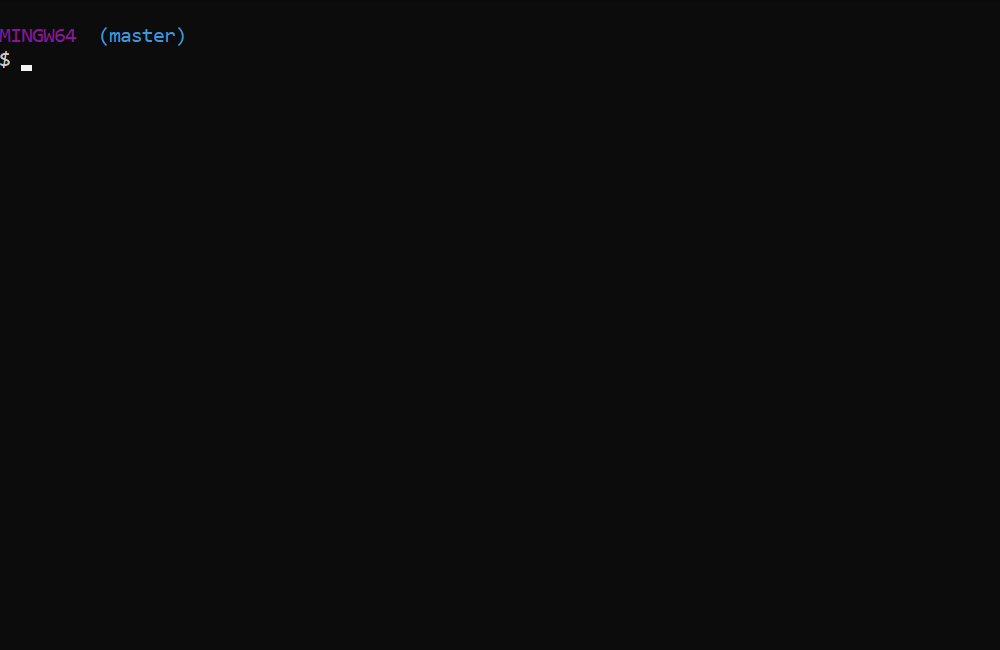

# word-guess-cli
Word Guess command-line game written in JS (with a Conspiracy/ET/Cryptozoology twist)

## Requirements
* [NodeJS](https://nodejs.org/en/download/)

## Setup
1. Ensure NodeJS is installed
1. Clone this repository to your workstation
1. Run `npm i` from inside the **word-guess-cli** folder

## Usage
* Navigate into the **word-guess-cli** folder
* Run `node index.js`
* Have fun!
* Note: You may exit the game at any time by pressing CTRL+C

## Game Play Example
